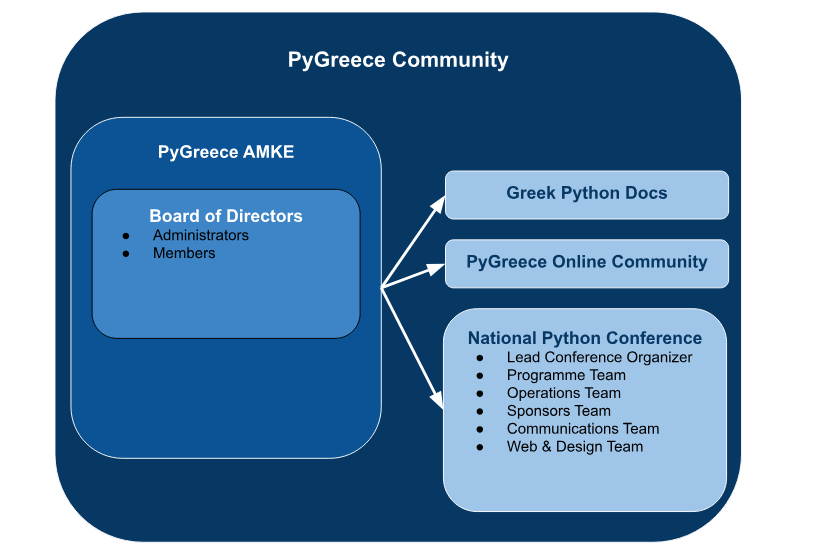

# PyGreece Community Organization & Bylaws

## Contents

- [Summary](#summary)
- [PyGreece AMKE](#pygreece-amke)
  - [Board of Directors](#board-of-directors)
  - [Directors](#directors)
  - [Member Roles](#member-roles)
  - [Current Board of PyGreece AMKE](#current-board-of-pygreece-amke)
  - [Board Lifecycle](#board-lifecycle)
  - [Inactivity of Directors](#inactivity-of-directors)
  - [Re-Election Limit](#re-election-limit)
  - [Board Elections](#board-elections)
- [PyGreece Community ByLaws](#pygreece-community-bylaws)

## Summary

The document is analyzing the structure of the PyGreece AMKE, as the legal entity of the Community, and the PyGreece Community bylaws. A nice schema, summarizing the PyGreece AMKE structure and the main activities done by the Community is the following:

## PyGreece AMKE

### Board of Directors

The board of directors is the main body of PyGreece AMKE. It's responsible for any strategic decision regarding the present & the future of the organization. Furthermore:

- Decides the budget, venue & dates of PyCon Greece.
- Decides the budget of all Python Community projects led by PyGreece Community members.

### Directors

There are two types of directors inside the board:

- _Administrators_: They are the managing members of the legal entity and have the authority to act on legal basis on behalf of the organization. Each PyGreece AMKE board should have 3 administrators who can act alone or as a group.
- _Members_: They cannot act on legal basis on behalf of the organization, although they can represent the organization. They have voting rights. Each PyGreece AMKE board can have 3 to 4 members.

### Member Roles

While the administrators are focused on running the legal entity of PyGreece AMKE, the members have specific roles, serving all actions running by the PyGreece Community. Those roles are:

- _PyGreece Community Projects_: This role is dedicated to the Projects run by PyGreece Community. The director with this role is responsible to find, identify, raise an idea, opportunity or need, initiate implementation, maintain, take forward every PyGreece Community Project, while making sure that more and more contributors will come on board, and we create an impact.
- _Community Outreach_: This role is dedicated to the PyGreece Community outreach and the online community server. The director is the main contact for community events that PyGreece Community attends and is responsible for strategic decision making regarding the discord server.
- _PyCon Greece_: This is role is monitoring the progress of PyCon Greece Conference. Is in contact with the board & the conference workgroups. More detailed:
  - Communicates with the board all important updates.
  - Selects the lead of each team.
  - Makes sure that the timeline of the conference will be met.

### Current Board of PyGreece AMKE

The current serving board of PyGreece AMKE for the term 2024-2025 is:

- Zisopoulos George, Administrator.
- Kyrillos Panagiotis, Member, managing PyCon Greece.
- Margaritis George, Member, managing PyGreece Community Outreach.
- Nikolaou Lysandros Nikolaou, Administrator.
- Petkos Theofanis, Administrator.
- Skias Panagiotis, managing PyGreece Community Projects.

### Board Lifecycle

Each board serves an annual term. In order to elect a new board a General Assembly (GA) needs to be hosted. The General Assembly needs to be called at least 15 days before the preferred date. At the same point, 15 days before the GA, the board needs to select an independent election committee & to find all the next board of directors candidates.

### Inactivity of Directors

In case a board member is inactive (has not attended 4 board meetings in a row) the board has the right to vote for their replacement. They are able to select another member as long as this member is a confirmed PyGreece Community member.

### Re-Election Limit

A member can serve a specific role (e.g Administrator or Responsible for PyCon Greece) two times in a row maximum. A member can be elected as a board member for a maximum of six times. The limits are reset in case the member takes a break for a term from the role and/or the board membership.

### Board Elections

Only registered members of the community have voting rights. The board is responsible to communicate a registration form through the PyGreece Discord Server 2 weeks before the elections.

The election committee, selected by the previous board, has no right to participate in the elections. The committee:

- Hosts the vote to confirm that the financial status of the organization is acceptable by the GA & to end the previous board term.
- Decides on the voting process that outlines the format of the Directors elections.
- Decides beforehand the process of resolving ties.
- Hosts the vote for the next board of directors.

Post election, the newly elected board decides the roles as they are described in the board structure section.

## PyGreece Community ByLaws

Below you can find the ByLaws of PyGreece Community, the Greek Python Community managed by the PyGreece AMKE. The rules of PyGreece AMKE entity are different and can be found here (TODO: Link to the doc).

1. The name of the community is "PyGreece Community", abbreviated "PyGreece".

2. The name of the legal entity responsible for "PyGreece Community" is "PyGreece AMKE".

3. PyGreece AMKE is a civil society actor (Civil Non-Profit Company) created by Greek Python Community members to serve the mission of PyGreece Community. The mission of PyGreece AMKE can be found [here](../about/en.md#mission).

4. The organization detals of PyGreece AMKE are [here](../about/en.md#organization-details)

5. Membership is open to individuals who wish to actively engage in implementing the PyGreece Community mission.

6. To become a member, the applicant must submit an application to the board of the PyGreece AMKE. The board accepts or declines the application by a simple majority vote at its next meeting. The board may delegate the right to accept membership application to one or more individual board members, but denial of membership must always be done by a vote of the board.

7. The formal decision making bodies of PyGreece Community are:

   - The General Assembly.
   - The Board of Directors.

8. The General Assembly is the highest decision making body of PyGreece Community. It meets in a regular annual meeting and in extra sessions when called by a PyGreece Community member. The General Assembly runs independent from the PyGreece AMKE, apart from selecting the next board.

9. All decisions of the General Assembly are made by simple majority among the voting members. Members may vote by proxy or submit written votes in specific issues to the board. All written votes must be declared by the administrators of PyGreece AMKE at the beginning of the meeting. If there is a draw between two proposals a second vote shall be made and so on.

10. An extra meeting of the General Assembly must be held within 28 days of the request. Members should be notified at least 5 days prior to the date of the GA (via discord and/or email).

11. The board of directors is responsible to select an independent host & the format of the GA with the agreement of the GA requester.

12. The board handles all day-to-day business of the PyGreece AMKE. It is allowed to enter contracts for PyGreece AMKE and handle any issues of the PyGreece Community that have not been otherwise regulated in the bylaws or by the General Assembly.

13. The administrators of the board have the authority to sign for PyGreece AMKE.

14. A member may at any time terminate the membership by informing the board in writing.

15. A member that acts against the interests of PyGreece Community or PyGreece AMKE may be expelled by the full majority decision of the board of directors. In case this member is a director, the director considered to be expelled is excluded from the vote and the decision needs the full majority of the rest of the board to pass. A member may be expelled from the General Assembly of PyGreece Community too, at an Assembly meeting by a regular vote with simple majority.

16. In case of dissolution, the assets of PyGreece AMKE go to an NGO voted by a General Assembly of PyGreece Community meeting.

17. Any motion to amend the bylaws of the society has to be submitted with the actual wording of the proposed change. The General Assembly may modify the proposal in detail before passing it, as long as the general intent of the motion is unchanged. A motion to change the bylaws must be supported by at least two thirds of the present voting representatives in order to pass.
