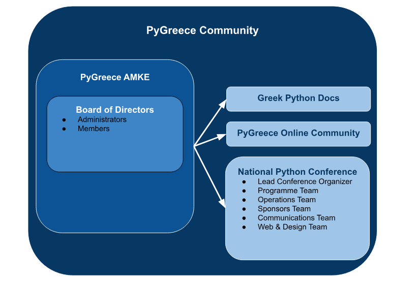

# PyGreece Community Organization & Principles

## Contents

- [Summary](#summary)
- [PyGreece AMKE](#pygreece-amke)
  - [Board of Directors](#board-of-directors)
  - [Directors](#directors)
  - [Member Roles](#member-roles)
  - [Current Board of PyGreece AMKE](#current-board-of-pygreece-amke)
  - [Board Lifecycle](#board-lifecycle)
  - [Inactivity of Directors](#inactivity-of-directors)
  - [Re-Election Limit](#re-election-limit)
  - [Board Elections](#board-elections)
- [PyGreece Community ByLaws](#pygreece-community-bylaws)

## Summary

This document is analyzing the structure of PyGreece AMKE, the legal entity of the
community, and the PyGreece community principles. A nice schema, summarizing the PyGreece
AMKE structure and the main activities done by the community is the following:

## PyGreece AMKE

### Board of Directors

The board of directors is the main body of PyGreece AMKE. It's responsible for any
strategic decision regarding the present & the future of the organization. Furthermore it
is responsible for:

- Deciding the budget, venue & dates of PyCon Greece.
- Deciding the budget of all Python community projects led by PyGreece community members.

### Directors

There are two types of directors inside the board:

- _Administrators_: They are the managing members of the legal entity and have the
  authority to act on legal basis on behalf of the organization. Each PyGreece AMKE board
  should have 3 administrators who can act alone or as a group.
- _Members_: They cannot act on legal basis on behalf of the organization, although they
  can represent the organization. They have voting rights.

### Member Roles

While the administrators are focused on running the legal entity of PyGreece AMKE, the
members have specific roles, serving all actions run by the PyGreece community. Those
roles are:

- _PyGreece community projects_: Directors with this role are dedicated to the Projects
  run by the PyGreece community. The director with this role is responsible to find,
  identify, raise ideas, opportunities or needs, initiate implementation, maintain, and
  take forward every PyGreece community project, while making sure that more and more
  contributors will come on board, and we create an impact.
- _Community outreach_: Directors with this role are responsible for the PyGreece
  community outreach and the online community server. They are the main contact for
  community events that the PyGreece community attends and they are responsible for
  strategic decision making regarding the discord server.
- _PyCon Greece_: Directors with this role are monitoring the progress of the PyCon Greece
  conference. They are in contact with the board & the conference workgroups. In more
  details, they:
  - Communicate all important updates with the board.
  - Select the lead of each team.
  - Make sure that the timeline of the conference will be met.

### Current Board of PyGreece AMKE

The current serving board of PyGreece AMKE for the term 2024-2025 is:

- Zisopoulos George, Administrator.
- Kyrillos Panagiotis, Member, managing PyCon Greece.
- Margaritis George, Member, managing PyGreece community outreach.
- Nikolaou Lysandros, Administrator.
- Petkos Theofanis, Administrator.
- Skias Panagiotis, managing PyGreece community projects.

### Board Lifecycle

Each board serves an annual term. In order to elect a new board a General Assembly (GA)
needs to be hosted. The General Assembly needs to be called at least 15 days before the
preferred date. At the same point, 15 days before the GA, the board needs to select an
independent election committee & to find all the next board of directors candidates.

### Inactivity of Directors

In case a board member is inactive (has not attended 4 board meetings in a row) the board
has the right to vote for their replacement. They are able to select another member as
long as this member is a confirmed PyGreece community member.

### Re-Election Limit

A member can serve a specific role (e.g Administrator or Responsible for PyCon Greece) two
times in a row maximum. A member can be elected as a board member for a maximum of six
times. The limits are reset in case the member takes a one-term break from the role and/or
the board membership.

### Board Elections

Only registered members of the community have voting rights. The board is responsible for
communicating a registration form through the PyGreece Discord Server two weeks before the
elections.

The election committee, selected by the previous board, has no right to participate in the
elections. The committee:

- Hosts the vote to confirm that the financial status of the organization is acceptable by
  the GA & to end the previous board term.
- Decides on the voting process that outlines the format of the Directors elections.
- Decides the process of resolving ties beforehand.
- Hosts the vote for the next board of directors.

After the election the newly elected board decides the roles as they are described in the
[Member Roles](#member-roles) section.

## PyGreece Community Principles

Below you can find the main principles of the PyGreece community, the Greek Python
community managed by PyGreece AMKE. The bylaws of the PyGreece AMKE entity are different
and can be found [here](https://publicity.businessportal.gr/company/180308907000).

> [!IMPORTANT] The board of PyGreece AMKE is currently working on the legal format of the
> community principles mentioned below. Therefore, while they are considered a very
> important part of the way that PyGreece community operates, they don't have any legal
> force yet.

- The name of the community is "PyGreece Community", abbreviated "PyGreece".

- The name of the legal entity responsible for "PyGreece Community" is "PyGreece AMKE".

- PyGreece AMKE is a civil society actor (Civil Non-Profit Company) created by Greek
  Python community members to serve the mission of the PyGreece community. The mission of
  PyGreece AMKE can be found [here](../about/en.md#mission).

- The organization detals of PyGreece AMKE are [here](../about/en.md#organization-details)

- Membership is open and free to individuals who wish to actively engage in implementing
  the PyGreece community mission.

- To become a member, the applicant must send an email to the PyGreece AMKE board of directors.

<!-- TODO: Provide a form for member registration -->

- The formal decision making bodies of the PyGreece community are:

  - The General Assembly.
  - The Board of Directors.

- The General Assembly is the highest decision making body of PyGreece community. It meets
  in a regular annual meeting and in extra sessions when called by a PyGreece community
  member. The General Assembly runs independently from PyGreece AMKE, apart from
  selecting the next board.

- All decisions of the General Assembly are made by simple majority among the voting
  members. Members may vote by proxy or submit written votes in specific issues to the
  board. All written votes must be declared by the administrators of PyGreece AMKE at the
  beginning of the meeting. If there is a draw between two proposals a second vote shall
  be made and so on.

- An extra meeting of the General Assembly must be held within 28 days of the request.
  Members should be notified at least 5 days prior to the date of the GA (via discord
  and/or email).

- The board of directors is responsible for selecting an independent host & the format of the
  GA with the agreement of the GA requester.

- The board handles all day-to-day business of PyGreece AMKE. It is allowed to enter
  contracts for PyGreece AMKE and handle any issues of the PyGreece community that have
  not been otherwise regulated in the bylaws or by the General Assembly.

- The administrators of the board have the authority to sign for PyGreece AMKE.

- A member may at any time terminate the membership by informing the board in writing.

- A member that acts against the interests of PyGreece community or PyGreece AMKE may be
  expelled by the full majority decision of the board of directors. In case this member is
  a director, the director considered to be expelled is excluded from the vote and the
  decision needs the full majority of the rest of the board to pass. A member may be
  expelled from the General Assembly of PyGreece community too, at an Assembly meeting by
  a regular vote with simple majority.

- In case of dissolution, the assets of PyGreece AMKE go to an NGO voted by a General
  Assembly of PyGreece community meeting.
